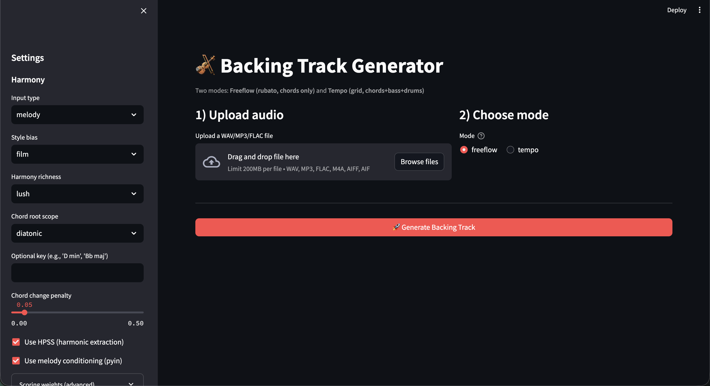
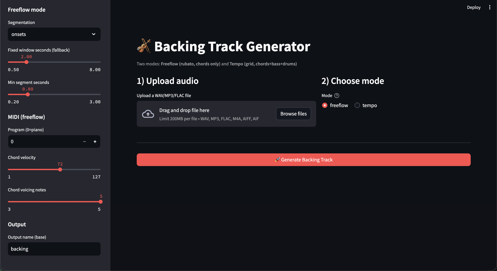
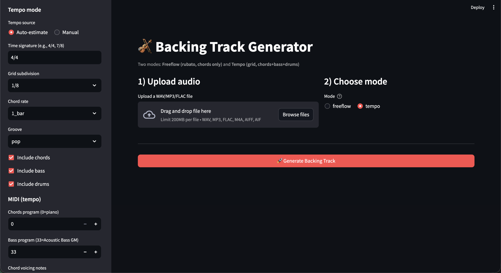

# 🎻 Backing Track Generator (Freeflow + Tempo)

A Streamlit app that generates a **MIDI backing track** from an input audio recording.

It supports **two modes**:

- **Freeflow** (rubato): chords-only, aligned to the performance in *real time* (great for solo violin / expressive timing)
- **Tempo** (grid): chords + bass + drums aligned to *BPM + time signature* (great for groove-based songs)

---

## Screenshots

> Place the screenshots in `docs/screenshots/` (recommended) and rename them like below.

### UI overview


### Freeflow mode controls


### Tempo mode controls


---

## Features

### ✅ Streamlined workflow
1. Upload audio (WAV/MP3/FLAC/etc.)
2. Pick mode (**freeflow** or **tempo**)
3. Adjust harmony + MIDI settings from the sidebar
4. Click **Generate Backing Track**
5. Download:
   - `.mid` backing track
   - `.json` report (key estimate, BPM/TS in tempo mode, chord timeline, config snapshot)

### 🎼 Harmony settings (sidebar)
- Input type: `melody` or `mixed`
- Style bias: `film`, `classical`, `pop`, `jazz`
- Harmony richness: `basic`, `rich`, `lush`
- Chord root scope: `diatonic` or `all_roots`
- Optional key override (e.g., `D min`, `Bb maj`)
- Chord change penalty (stability vs. movement)
- Optional analysis toggles:
  - HPSS (harmonic extraction)
  - Melody conditioning (pyin)
- Advanced scoring weights (optional tuning)

### 🟦 Freeflow mode (rubato)
- Segmentation: `onsets` / `auto` / `fixed`
- Fixed window seconds (fallback)
- Min segment seconds
- MIDI settings:
  - Program (instrument)
  - Velocity
  - Chord voicing note-count
- Output base name (e.g., `backing.mid`, `backing.json`)

**Best for:** solo violin, classical phrasing, no stable tempo.

### 🟩 Tempo mode (grid)
- Tempo source: Auto-estimate OR Manual BPM
- Time signature (e.g., `4/4`, `7/8`)
- Grid subdivision: `1/8` or `1/16`
- Chord rate: `1_bar`, `2_bars`, `2_beats`
- Groove: `pop`, `rock`, `funk`, `edm`
- Toggle tracks:
  - Include chords
  - Include bass
  - Include drums
- MIDI programs (chords/bass) + velocities + chord voicing note-count

**Best for:** songs with pulse, groove-based composition, structured accompaniment.

---

## How it works (high level)

### Freeflow mode
- Uses harmonic features (chroma) and optional melody extraction (pyin)
- Segments the performance in *real seconds*
- Chooses a best-fit chord per segment using scoring
- Writes a **time-aligned MIDI** (1 tick ≈ 1ms approach for easy alignment in DAWs)

### Tempo mode
- Uses BPM (manual or estimated) + time signature to build a grid
- Estimates chords per bar/beat region
- Adds:
  - bass (root/fifth motion)
  - drums (GM channel patterns)
- Writes a standard tempo-based multi-track MIDI

---

## Installation

### Requirements
- Python 3.10+ recommended

Install dependencies:

```bash
pip install -r requirements.txt
```

f you run into audio decoding issues for MP3/M4A on your OS, install `ffmpeg`:
- macOS: `brew install ffmpeg`
- Ubuntu: `sudo apt-get install ffmpeg`

---

## Run the app

From the project root (where `ui_app.py` lives):

```bash
streamlit run ui_app.py
```

Open:
- http://localhost:8501

---

## DAW tips

### “My MIDI has no sound”
MIDI contains **notes**, not audio. In Ableton:
1. Create a MIDI track
2. Drop an instrument (Piano / Pad / Kontakt / etc.)
3. Put the MIDI clip on that track

### Alignment guidance
- **Freeflow mode:** align the **start of the audio clip** and **start of the MIDI clip** to the same timestamp.  
  The chords are placed in real-time seconds (rubato-friendly).
- **Tempo mode:** set Ableton tempo to match the generated BPM (or warp the audio to bar 1).  
  Best results happen when audio has a clear pulse.

---

## Project structure

```
freeflow_harmonizer/
  cli.py                  # CLI entry
  pipeline.py             # routes freeflow vs tempo
  config.py               # all config dataclasses
  prompts.py              # interactive CLI prompts

  audio/                  # audio loading + features
  harmony/                # chord vocab + scoring + voicing
  segmentation/           # onset/fixed/auto segmentation
  tempo/                  # BPM detection + grid building
  patterns/               # drums + bass generators
  midi/                   # writers for freeflow + tempo
ui_app.py                 # Streamlit UI
```

---
